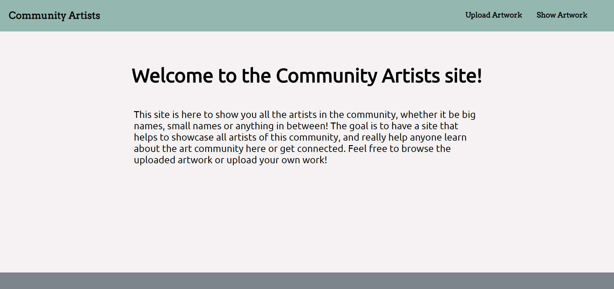
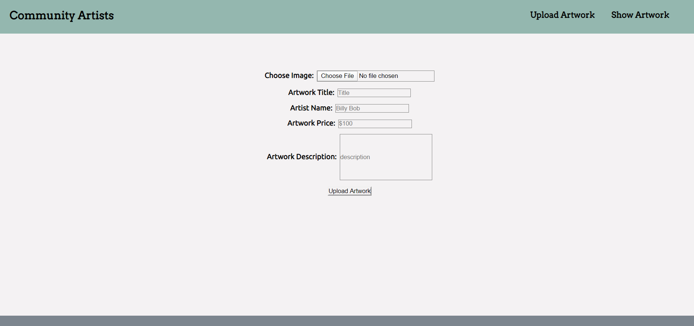
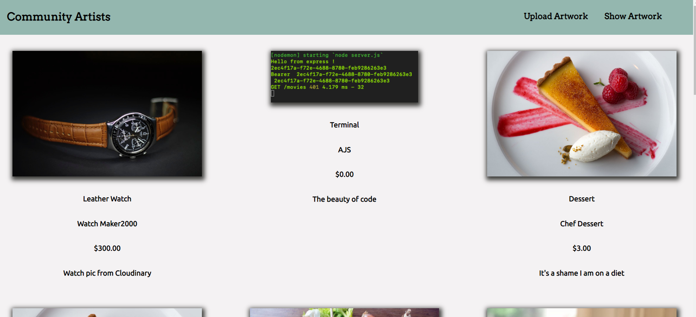

<h1>Community Artist App</h1>

https://community-artist-app.now.sh/

This front-end is put together using React

This project is titled Community Artist, and it's a web application that I feel has a lot of potential in the real world. 

In the real world for the art community people outside of the art community either trying to find out more about it or wanting to join it have a hard time figuring out the community. This website is a good starter, and I do plan on adding a sign on feature and a sorting feature in later iterations. 

This website will bring the community to a one stop shop of the art community. 

Notice how there is also a price section, and that will be another iteration so people can also buy the artwork they like.

Challenges while making this was learning how to send an image to the server, and learning axios to do that with. 

Landing Page: 

Upload Artwork Page:

Show Artwork Page: 
